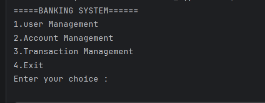
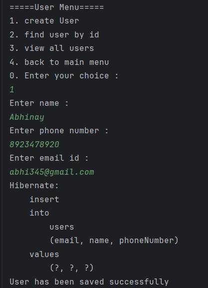
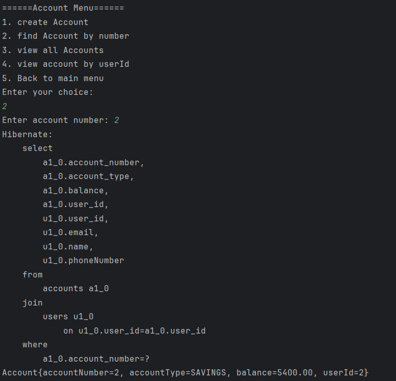
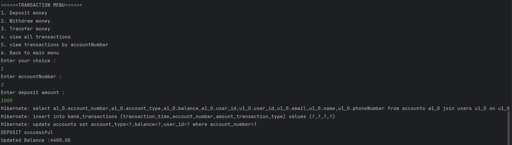
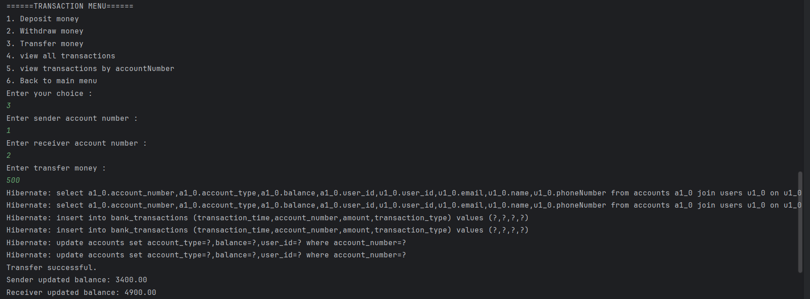

# Hibernate Banking Management System

A console-based Banking Management System built using **Java, Hibernate ORM, Maven, and MySQL**.

This project demonstrates layered backend architecture, Hibernate entity relationships, and atomic banking operations such as deposit, withdrawal, and account-to-account transfer.

---

## Project Status

Completed modules:

- User Management
- Account Management
- Deposit and Withdraw Transactions
- Atomic Money Transfer
- Transaction History
- Hibernate Entity Relationships
- Git and GitHub Branch Workflow

---

## Tech Stack

| Technology | Purpose |
|---|---|
| Java | Core programming language |
| Hibernate ORM | Object-Relational Mapping framework |
| MySQL | Relational database |
| Maven | Dependency management and build tool |
| MySQL Connector/J | MySQL database connectivity |
| IntelliJ IDEA | Development IDE |
| Git & GitHub | Version control and code hosting |

---

## Features

### User Management

- Create user
- Find user by ID
- View all users

### Account Management

- Create account for an existing user
- Find account by account number
- View all accounts
- View accounts by user ID

### Transaction Management

- Deposit money
- Withdraw money
- Transfer money between accounts
- View all transactions
- View transactions by account number

---

## Project Architecture

The project follows a layered architecture:

```text
Controller Layer
      ↓
Service Layer
      ↓
Repository Layer
      ↓
Hibernate ORM
      ↓
MySQL Database
```

| Layer | Responsibility |
|---|---|
| Controller | Handles console menu, user input, and output |
| Service | Handles validation and business decisions |
| Repository | Handles Hibernate database operations |
| Entity | Maps Java classes to database tables |
| Config | Manages Hibernate configuration and SessionFactory |

---

## Folder Structure

```text
src/main/java/com/bank
│
├── config
│   └── HibernateUtil.java
│
├── controller
│   ├── MainController.java
│   ├── UserController.java
│   ├── AccountController.java
│   └── BankTransactionController.java
│
├── entity
│   ├── User.java
│   ├── Account.java
│   ├── AccountType.java
│   ├── BankTransaction.java
│   └── TransactionType.java
│
├── repository
│   ├── interfaces
│   │   ├── UserRepository.java
│   │   ├── AccountRepository.java
│   │   └── BankTransactionRepository.java
│   │
│   └── impl
│       ├── UserRepositoryImpl.java
│       ├── AccountRepositoryImpl.java
│       └── BankTransactionRepositoryImpl.java
│
├── service
│   ├── interfaces
│   │   ├── UserService.java
│   │   ├── AccountService.java
│   │   └── BankTransactionService.java
│   │
│   └── impl
│       ├── UserServiceImpl.java
│       ├── AccountServiceImpl.java
│       └── BankTransactionServiceImpl.java
│
└── main
    └── BankApplication.java
```

---

## Database Tables

The project uses three main tables:

```text
users
accounts
bank_transactions
```

---

## Entity Relationships

### User to Account

One user can have many accounts.

```text
User 1 ─────── many Accounts
```

Hibernate mapping:

```java
@OneToMany(mappedBy = "user")
private List<Account> accounts;
```

```java
@ManyToOne
@JoinColumn(name = "user_id")
private User user;
```

Database relationship:

```text
users.user_id → accounts.user_id
```

---

### Account to BankTransaction

One account can have many bank transactions.

```text
Account 1 ─────── many BankTransactions
```

Hibernate mapping:

```java
@OneToMany(mappedBy = "account")
private List<BankTransaction> transactions;
```

```java
@ManyToOne
@JoinColumn(name = "account_number")
private Account account;
```

Database relationship:

```text
accounts.account_number → bank_transactions.account_number
```

---

## Database Schema Overview

### users

| Column | Description |
|---|---|
| user_id | Primary key |
| name | User name |
| email | Unique user email |
| phoneNumber | User phone number |

### accounts

| Column | Description |
|---|---|
| account_number | Primary key |
| account_type | SAVINGS or CURRENT |
| balance | Account balance |
| user_id | Foreign key referencing users |

### bank_transactions

| Column | Description |
|---|---|
| transaction_id | Primary key |
| transaction_type | DEPOSIT or WITHDRAW |
| amount | Transaction amount |
| transaction_time | Date and time of transaction |
| account_number | Foreign key referencing accounts |

---

## Atomic Banking Operations

Deposit, withdrawal, and transfer are handled using Hibernate transactions.

### Deposit Flow

```text
Find account
      ↓
Increase balance
      ↓
Save DEPOSIT transaction
      ↓
Commit transaction
```

### Withdraw Flow

```text
Find account
      ↓
Check sufficient balance
      ↓
Decrease balance
      ↓
Save WITHDRAW transaction
      ↓
Commit transaction
```

### Transfer Flow

```text
Find sender account
      ↓
Find receiver account
      ↓
Check sender balance
      ↓
Debit sender account
      ↓
Credit receiver account
      ↓
Save WITHDRAW record for sender
      ↓
Save DEPOSIT record for receiver
      ↓
Commit transaction
```

If any step fails, the transaction is rolled back.

---

## Console Menus

### Main Menu

```text
===== BANKING SYSTEM =====
1. User Management
2. Account Management
3. Transaction Management
4. Exit
```

### User Menu

```text
1. Create User
2. Find User By ID
3. View All Users
4. Back To Main Menu
```

### Account Menu

```text
1. Create Account
2. Find Account By Number
3. View All Accounts
4. View Accounts By User ID
5. Back To Main Menu
```

### Transaction Menu

```text
1. Deposit Money
2. Withdraw Money
3. Transfer Money
4. View All Transactions
5. View Transactions By Account Number
6. Back To Main Menu
```

---

## Screenshots

> Add screenshots inside a folder named `screenshots`.

### Main Menu



### User Management



### Account Management



### Transaction Management



### Transfer Money



---

## Hibernate Configuration

The project uses `hibernate.cfg.xml` to configure Hibernate.

Main responsibilities:

- Database connection
- MySQL driver configuration
- Hibernate dialect
- SQL logging
- Entity mappings
- Automatic table update

Example:

```xml
<property name="hibernate.connection.driver_class">com.mysql.cj.jdbc.Driver</property>
<property name="hibernate.connection.url">jdbc:mysql://localhost:3306/hibernate_bank</property>
<property name="hibernate.connection.username">root</property>
<property name="hibernate.connection.password">YOUR_PASSWORD</property>

<property name="hibernate.show_sql">true</property>
<property name="hibernate.format_sql">true</property>
<property name="hibernate.hbm2ddl.auto">update</property>
```

> Do not push your real database password to GitHub. Replace it with `YOUR_PASSWORD`.

---

## How to Run the Project

### Prerequisites

Make sure these are installed:

- Java 17 or above
- Maven
- MySQL
- IntelliJ IDEA or any Java IDE

### Step 1: Clone the Repository

```bash
git clone https://github.com/ganesh-nagi/Hib_Banking_Management_System.git
```

### Step 2: Open Project

Open the project in IntelliJ IDEA or any Java IDE.

### Step 3: Create Database

Run this in MySQL:

```sql
CREATE DATABASE hibernate_bank;
```

### Step 4: Update Database Password

Open:

```text
src/main/resources/hibernate.cfg.xml
```

Update:

```xml
<property name="hibernate.connection.password">YOUR_PASSWORD</property>
```

Use your local MySQL password.

### Step 5: Run Application

Run:

```text
BankApplication.java
```

Hibernate will create or update the required tables automatically.

---

## Git Workflow Used

This project was developed phase by phase using Git branches.

| Branch | Purpose |
|---|---|
| main | Stable code |
| phase-2-account-module | Account module |
| phase-3-transaction-module | Deposit and withdraw |
| phase-4-transfer-module | Transfer money |

Typical workflow:

```bash
git checkout -b feature-branch
git add .
git commit -m "meaningful commit message"
git push -u origin feature-branch
```

Changes are merged into `main` using Pull Requests.

---

## Important Concepts Learned

- Hibernate maps Java objects to database tables.
- HQL uses Java class and field names, not SQL table names.
- `SessionFactory` should be created only once.
- `persist()` is used for saving new objects.
- `merge()` is used for updating detached objects.
- Banking operations must be atomic.
- Deposit, withdrawal, and transfer should use database transactions.
- Git branches help protect stable code.
- Clean architecture improves maintainability.

---

## Future Improvements

- Add login system
- Add password hashing
- Add custom exceptions
- Improve input validation
- Add transfer ID grouping
- Add account status such as ACTIVE or CLOSED
- Add admin module
- Add transaction filtering by date
- Build Spring Boot REST API version
- Add Spring Data JPA version
- Add unit tests
- Add Docker support
- Add proper logging using SLF4J and Logback
- Add Flyway or Liquibase for database migrations

---

## Author

**Nagendra Ganesh**

GitHub: [ganesh-nagi](https://github.com/ganesh-nagi)

---

## Project Type

Backend learning project focused on:

- Java layered architecture
- Hibernate ORM
- Database relationships
- Transaction management
- Git and GitHub workflow
